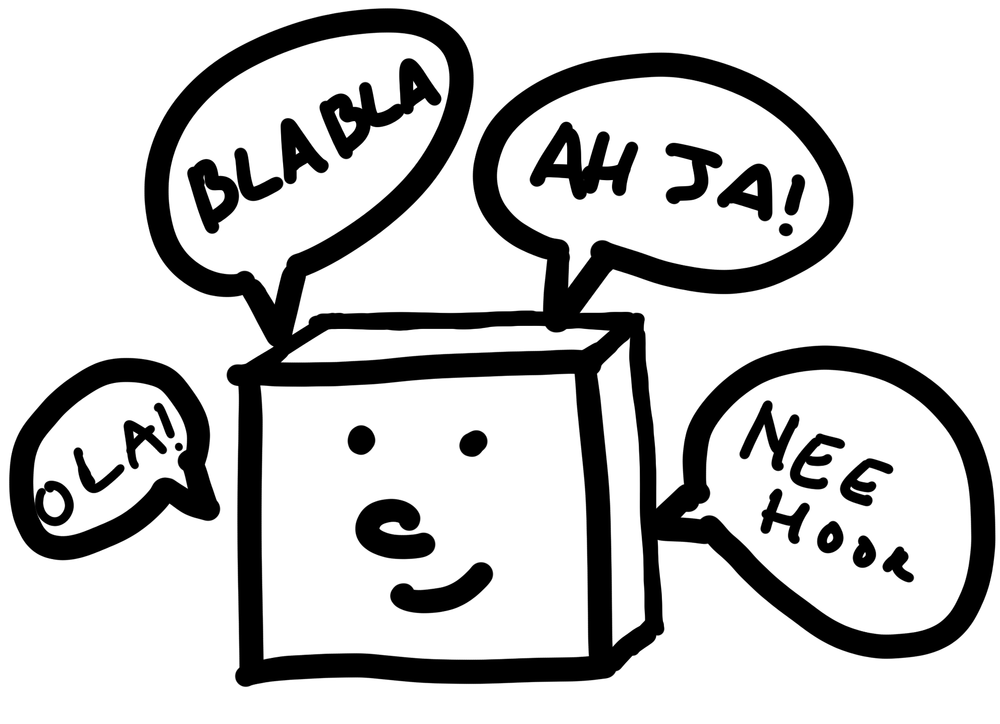

# Welkom bij meester Wouter's virtuele klas
Stoffige klaslokalen zijn zo pass&eacute; ... meester Wouter brengt zijn klas naar de virtuele wereld!

# Taken, nieuws en discussies
Taken, correctiesleutels, nieuws en discussies vind je op:

||
|---|
|[![google classroom][9]][10]|
|[Google classroom   De Linde 6A (2019-2020)](https://classroom.google.com/u/0/c/NTQ4MDcyNDUwMDRa) |
[9]: images/google_classroom.png
[10]: https://classroom.google.com/u/0/c/NTQ4MDcyNDUwMDRa

Je hebt een code nodig om toegang te krijgen tot de klas. Heb je deze niet? Vraag de code aan je leraar!

# Babbelbox

Op regelmatige tijdstippen organiseert meester Wouter een "babbelbox": een videochat!
Je kan je vrienden en vriendinnen nog eens terugzien, vragen stellen aan meester Wouter, virtueel les volgen ...

De software die we gebruiken is "webex", net zoals in het werkwoord: ik  webex, jij webext, wij webexen ... ;-)  
[Hier](babbelbox.md) vind je meer uitleg.